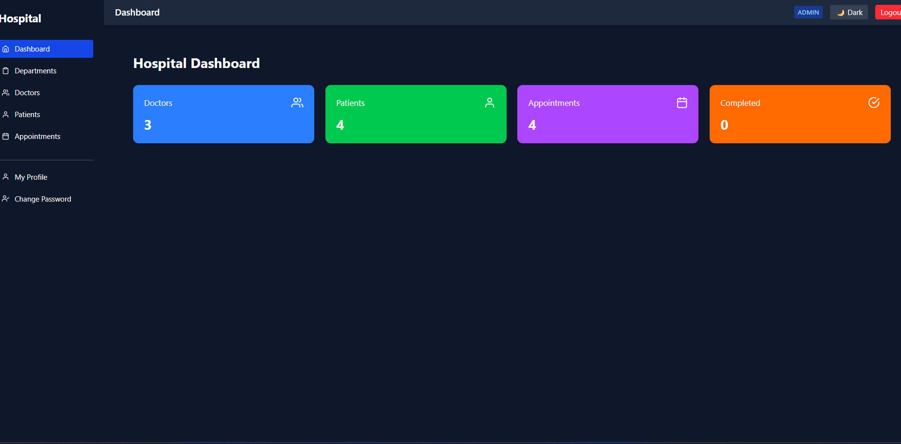
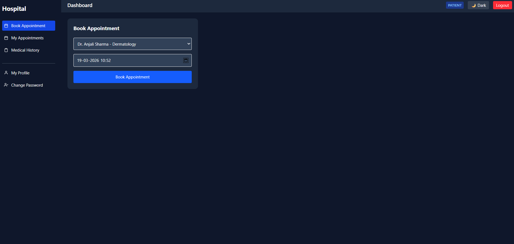
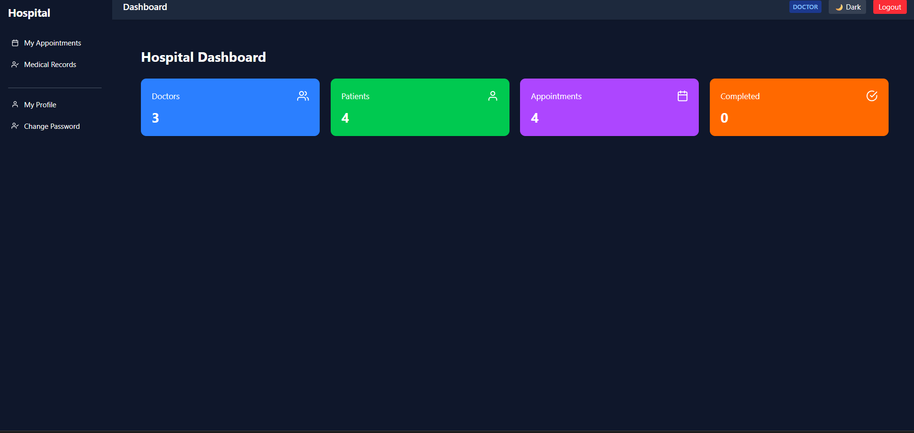
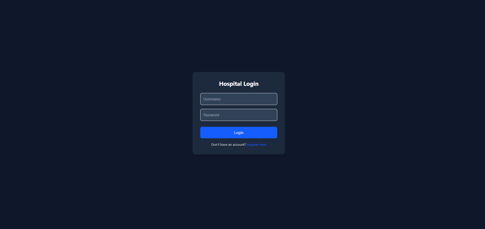
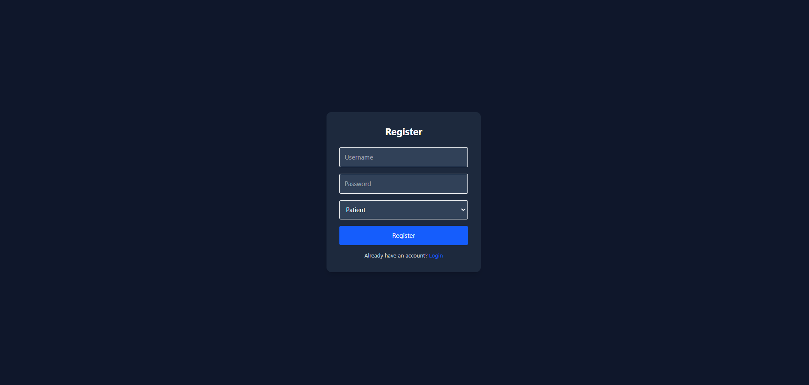

# 🏥 Hospital Management System

A full-stack **Hospital Management System** built using **Spring Boot, React, and PostgreSQL**.
This application allows **Admins, Doctors, and Patients** to manage hospital operations such as appointments, patient records, and doctor management through a secure and user-friendly dashboard.

---

## 🚀 Features

### 👨‍⚕️ Admin

* Manage **Departments**
* Manage **Doctors**
* Manage **Patients**
* View **Appointments**
* View **Dashboard Statistics**

### 🩺 Doctor

* View **Assigned Appointments**
* Access **Patient Information**
* Manage **Appointment Status**

### 🧑‍💻 Patient

* **Book Appointments**
* View **Appointment History**
* Access **Medical Records**
* Manage **Profile**

---

## 🛠️ Tech Stack

### Frontend

* React.js
* Tailwind CSS
* Axios
* React Router

### Backend

* Java
* Spring Boot
* Spring Security (JWT Authentication)
* REST APIs

### Database

* PostgreSQL

### Tools

* Git & GitHub
* VS Code
* Postman
* Maven

---

## 🏗️ System Architecture

```
React Frontend
      │
      │  REST API (Axios)
      ▼
Spring Boot Backend
      │
      │  JPA / Hibernate
      ▼
PostgreSQL Database
```

---

## 📸 Project Screenshots

### Admin Dashboard



### Book Appointment



### Patient Appointments


### Doctor Dashboard



### Manage Doctors


### Login Page



### Register Page



---

## 🔐 Authentication & Security

* **JWT Authentication**
* **Role-Based Access Control**
* Secure REST APIs
* Protected routes in frontend

---

## 📦 Installation

### 1️⃣ Clone the Repository

```
git clone https://github.com/vishalpandey055/hospital-management-system.git
```

### 2️⃣ Backend Setup

```
cd hospital-backend
mvn spring-boot:run
```

Backend runs on:

```
http://localhost:8080
```

---

### 3️⃣ Frontend Setup

```
cd hospital-frontend
npm install
npm run dev
```

Frontend runs on:

```
http://localhost:5173
```

---

## 🗄️ Database Configuration

Configure PostgreSQL in `application.properties`:

```
spring.datasource.url=jdbc:postgresql://localhost:5432/Hospital_db
spring.datasource.username=postgres
spring.datasource.password=yourpassword
spring.jpa.hibernate.ddl-auto=update
```

---

## 📊 API Examples

### Login

```
POST /api/auth/login
```

### Get Doctors

```
GET /api/doctors
```

### Book Appointment

```
POST /api/appointments
```

### Get Dashboard Stats

```
GET /api/admin/stats
```

---

## 🌟 Future Improvements

* Email Notifications for Appointments
* Doctor Availability Scheduling
* Appointment Status Tracking
* Analytics Dashboard with Charts
* Online Payments Integration

---

## 👨‍💻 Author

**Vishal Kumar Pandey**

* 🌍 India
* 💻 Full Stack Developer
* 🚀 Passionate about building scalable web applications

GitHub:
https://github.com/vishalpandey055/

---

## ⭐ Support

If you like this project, please ⭐ the repository.
It motivates me to build more open-source projects.
